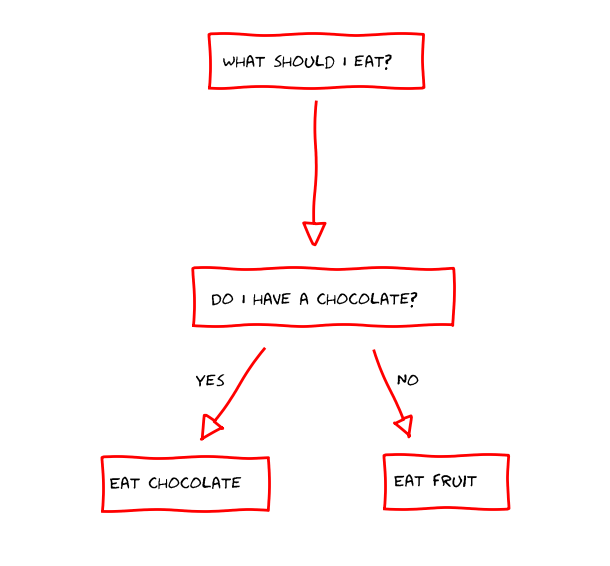
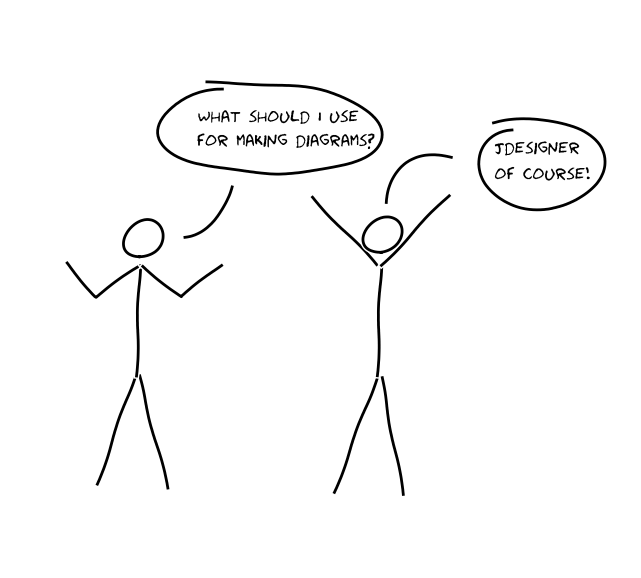
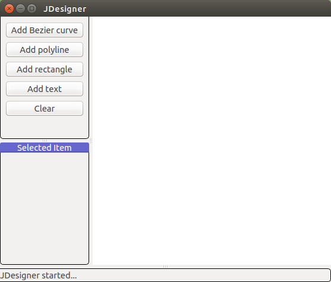
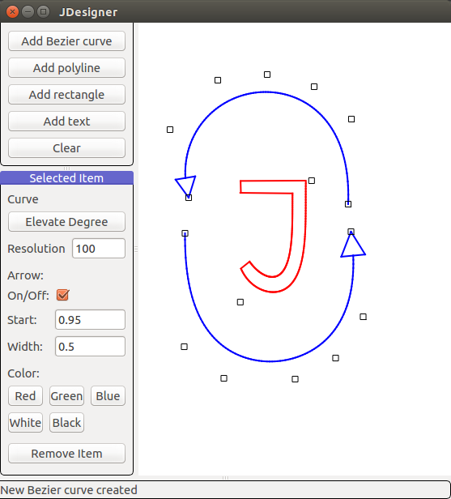
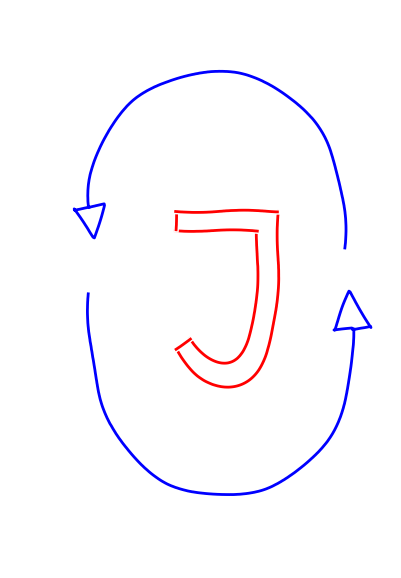

Jdesigner is an XKCD designer for mathematicians. 

Examples
========

Here are two figures which were made with the Jdesigner. 

The first one is a simple diagram:

The second one is a comic in XKCD style:

Features
========

This is a screenshot of the Jdesigner:

You can create a figure from a set of primitives:
* Bezier curves,
* polylines,
* squares,
* and texts.

The primitives can be combined together into a composition, see Load Composition
option in the main menu.

Jdesigner has it own file format; you can save your current work to a .jdes file
and then load this file later. See examples of *.jdes files in the folder
[examples](examples/)

Once you construct a figure, you can export it to a .png file. There are two
export options. The first export is a "normal" export. The second export
"XKCD-fies" your figure.

Jdesigner in action
-------------------

Designing a figure:

And then exporting it in XKCD style:

Installation
============

* Install dependencies.
* Run Jdesigner from a command line.

Dependencies
------------

* python (tested on python3.4)
* pyqtgraph (tested on pyqtgraph 0.9.10)
* matplotlib (tested on matplotlib 1.3.1)

License
=======

See the file [license.txt](license.txt). 

